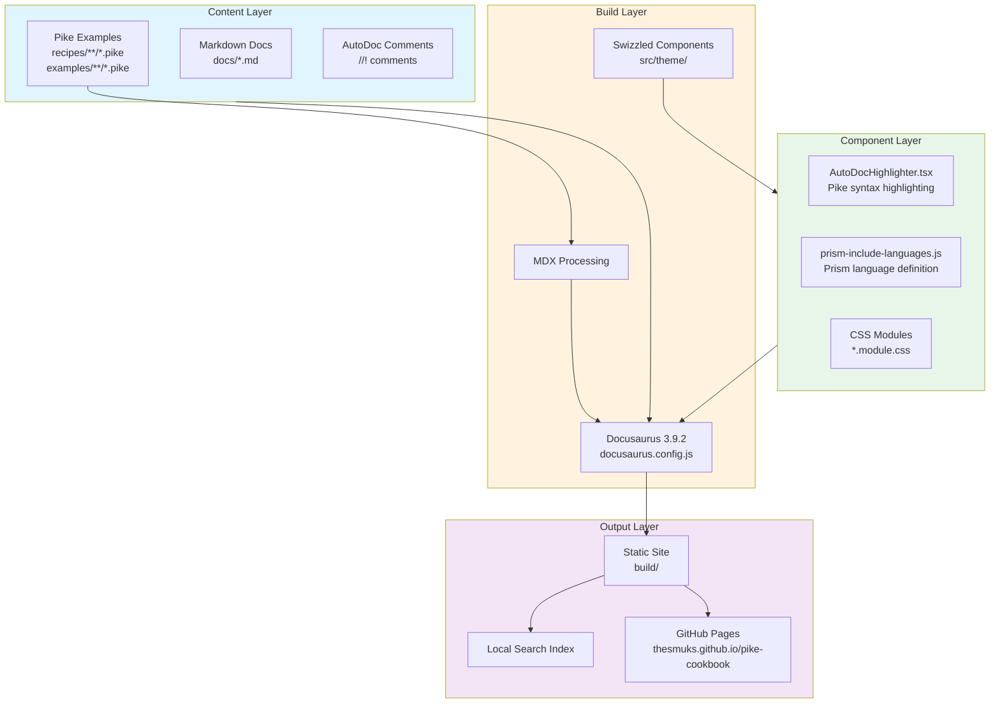
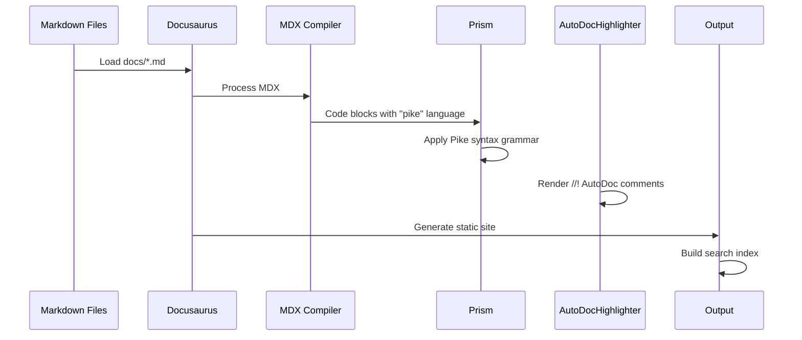
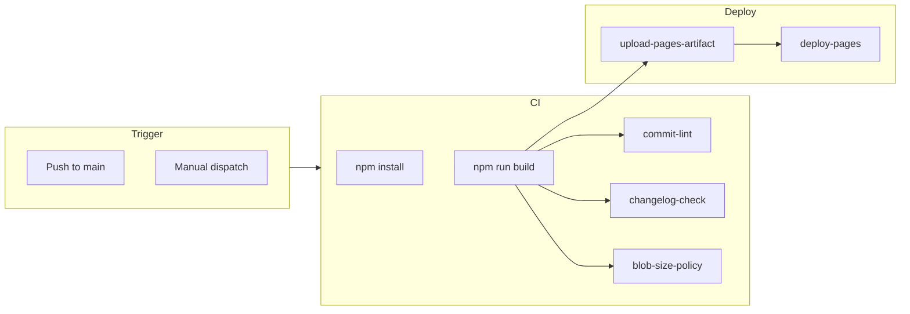

# Pike Cookbook Architecture

## System Overview



## Component Responsibilities

### Content Layer

| Directory | Purpose | Key Files |
|-----------|---------|-----------|
| `docs/` | Markdown documentation | intro.md, basics/*.md, files/*.md, network/*.md, advanced/*.md |
| `recipes/` | Pike code examples | database/*.pike, process/*.pike |
| `examples/` | Additional Pike recipes | webautomation/*.pike |
| `pleac_pike/` | PLEAC reference | ui_examples/*.pike |

### Build Layer

| File | Purpose |
|------|---------|
| `docusaurus.config.js` | Site configuration, plugins, theming |
| `sidebars.js` | Documentation navigation structure |
| `src/client/index.js` | Client-side module registration |

### Component Layer

| File | Purpose |
|------|---------|
| `src/components/AutoDocHighlighter.tsx` | Renders Pike AutoDoc syntax with styled tags |
| `src/theme/prism-include-languages.js` | Defines Pike grammar for Prism syntax highlighter |
| `src/theme/DocPage/` | Swizzled DocPage for custom rendering |

## Data Flow



## Theme Customization

### Swizzle Strategy

The project uses Docusaurus swizzling for targeted overrides:

1. **Safe swizzles** (rarely need updates):
   - `DocItem` - Custom doc page layout
   - `CodeBlock` - Code block styling

2. **Common swizzles** (may need updates):
   - `SearchBar` - Search positioning
   - `Navbar` - Navigation links

### AutoDoc Highlighting

The `AutoDocHighlighter` component parses Pike AutoDoc comments:

```
//! @param key
//!   The lookup key
//! @returns
//!   The associated value
```

Supported tags: `@param`, `@returns`, `@note`, `@seealso`, `@deprecated`, `@throws`, `@example`, `@bug`, `@dl`, `@member`, `@item`, `@code`, `@i{}`, `@b{}`, `@tt{}`

## Build Process

```mermaid
flowchart LR
    subgraph Input
        DOCS[docs/**/*.md]
        SRC[src/**/*.{tsx,js,css}]
        PIKE[recipes/**/*.pike]
    end

    subgraph Process
        BUILD[Docusaurus Build]
        MDX[MDX]
        TS[TypeScript Compile]
        PRISM[Prism Definition]
    end

    subgraph Output
        HTML[build/**/*.html]
        CSS[build/**/*.css]
        JS[build/**/*.js]
        SEARCH[search-index.json]
    end

    Input --> Process
    Process --> Output
```

## CI/CD Pipeline



## Key Decisions

| Decision | Rationale |
|----------|-----------|
| Local search over Algolia | Simpler setup, no external service |
| Pike language custom Prism grammar | Built-in Pike support insufficient |
| MDX for doc content | Enables React components in docs |
| GitHub Pages deployment | Free hosting, GitHub integration |

## Project Constraints

- **Max Pike file size**: 400 lines (see `.architecture.yml`)
- **Max function size**: 60 lines
- **TypeScript strict mode**: Required for all `.tsx` files
- **Build compatibility**: Must work with Node.js 20 (GitHub Actions)
